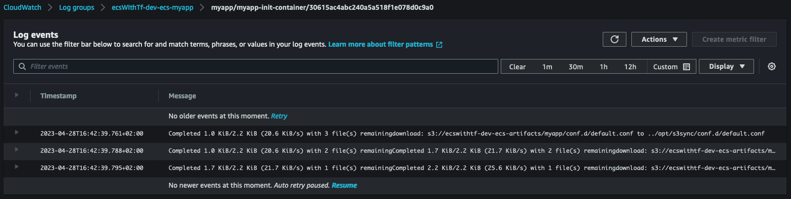
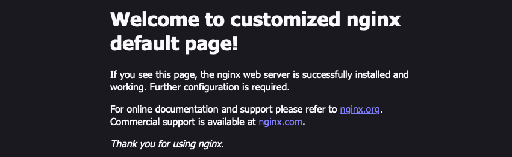
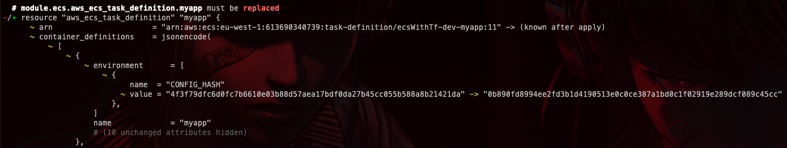

# ECS with terraform

J'ai récemment eu le besoin de déployer une application sans avoir accès à une réelle infra sous jacente, l'environnement étant principalement serverless.  
L'option ECS Fargate s'est donc assez rapidement présentée et je trace ici mes premiers "vrai" pas avec la solution.  

Cet article couvre pour l'instant :  
- démarrer un conteneur et un serivce dans un cluster ECS
- intéragir avec les conteneurs via ssm et 'ecs exec'
- configurer et logguer dans cloudwatch
- exposer un service via un load balancer
- uploader des fichiers de configuration via s3/init-conteneur
- gérer le rédémarrage automatique sur changement de configuration

L'intégralité du code peut être trouvé sur github : [pbenefice/ecs-fargate-with-terraform](https://github.com/pbenefice/ecs-fargate-with-terraform/tree/main/terraform/modules/ecs)  

**Contexte** : Il s'agissait de tester une application tierce. Je n'avais pas donc pas la main sur le code.  
J'ai également souhaité éviter toutes les solutions impliquant de builder ma propre image docker. Partisant du moindre effort : les images existant déjà j'ai préféré une solution capitalisant sur des ressources gérées par d'autres.  
Le choix s'es porté sur ECS Fargate principalement sur l'intuition d'une relative simplicité et de la possibilité de piloter l'ensemble via terraform qui était déjà en place.  

**Disclaimer** : il ne s'agit pas de la vérité, ou d'un état de l'art, mais de la documentation d'une 1ère approche, dans un contexte spécifique. Cela sera surement amenée à évoluer la prochaine fois que je serais confronté à l'outil ou en fonction des retours que j'aurais.  
N'hésitez surtout pas si vous avez des retours critiques, ils sont bienvenus!  

**Prerequis** : Je considére ici que certains éléments existent déjà dans le compte AWS ou nous ferons nos tests. Notamment un VPC configuré avec des réseaux privé ayant un accès a internet via une NAT Gateway. Le repository de démonstration contient du code permettant de mettre en place ces prerequis si nécessaire.  
> Voir [/terraform/stacks/prerequisites sur le dépot github](https://github.com/pbenefice/ecs-fargate-with-terraform/tree/main/terraform/stacks/prerequisites)  

## Cluster et 1er container

Commençons par créer le cluster et faire tourner un simple container dessus.  
Il nous faut donc :
- un cluster et un log group associé,
- un service & une task definition,
- un rôle iam (qui permettra à terme de donner des droits au container),
- un security group

Nous prendrons une image Debian pour faciliter les tests dans un premier temps. Le code ressemble donc à :  
> Voir également le [commit `feat: cluster & first container` sur le dépot github](https://github.com/pbenefice/ecs-fargate-with-terraform/commit/3bada7df9a65e615b12d11bd2abd00b2eb4384e7)  

```terraform
locals {
  prefix   = "${var.project_prefix}-${var.env}"
  app_name = "myapp"
}

resource "aws_cloudwatch_log_group" "ecs_cluster" {
  name = "${local.prefix}-ecs-cluster"
}
resource "aws_ecs_cluster" "this" {
  name = local.prefix

  configuration {
    execute_command_configuration {
      logging = "OVERRIDE"

      log_configuration {
        cloud_watch_log_group_name = aws_cloudwatch_log_group.ecs_cluster.name
      }
    }
  }
}

resource "aws_ecs_task_definition" "myapp" {
  family                   = "${local.prefix}-${local.app_name}"
  requires_compatibilities = ["FARGATE"]
  network_mode             = "awsvpc"
  cpu                      = 1024
  memory                   = 2048

  task_role_arn = aws_iam_role.ecs_task_role_myapp.arn

  container_definitions = jsonencode([
    {
      name   = local.app_name
      image  = "debian:buster-20230411-slim"
      cpu    = 1024
      memory = 2048

      command         = [ "sleep", "3600" ],
      linuxParameters = {
        "initProcessEnabled"= true
      }
    }
  ])

  runtime_platform {
    operating_system_family = "LINUX"
    cpu_architecture        = "X86_64"
  }
}
resource "aws_ecs_service" "myapp" {
  name            = "${local.prefix}-${local.app_name}"
  cluster         = aws_ecs_cluster.this.id
  task_definition = aws_ecs_task_definition.myapp.arn
  desired_count   = 1

  enable_execute_command = true

  launch_type = "FARGATE"

  network_configuration {
    subnets          = var.private_subnets
    security_groups  = [aws_security_group.myapp.id]
    assign_public_ip = false
  }
}

resource "aws_iam_role" "ecs_task_role_myapp" {
  name = "${local.prefix}-ecs-task-role-${local.app_name}"

  assume_role_policy = jsonencode({
    Version = "2012-10-17"
    Statement = [
      {
        Action = "sts:AssumeRole"
        Effect = "Allow"
        Sid    = ""
        Principal = {
          Service = "ecs-tasks.amazonaws.com"
        }
      }
    ]
  })

  inline_policy {
    name = "requirements-for-ecs-exec"

    policy = jsonencode({
      Version: "2012-10-17",
      Statement: []
    })
  }
}

resource "aws_security_group" "myapp" {
  name        = "${local.prefix}-ecs-${local.app_name}"
  description = "manage rules for ${local.app_name} ecs service"
  vpc_id      = var.vpc_id

  egress {
    from_port        = 0
    to_port          = 0
    protocol         = "-1"
    cidr_blocks      = ["0.0.0.0/0"]
    ipv6_cidr_blocks = ["::/0"]
  }
}
```

Nous avons un premier conteneur qui tourne sur AWS :  
  

## ECS Exec

[ECS Exec](https://docs.aws.amazon.com/en_en/AmazonECS/latest/userguide/ecs-exec.html) est une feature qui permet d'interagir et notamment se connecter dans les containers directement via la cli aws.  
En s'appuyant sur les prerequis détaillés dans le lien précédent, modifions le rôle iam pour y ajouter une policy inline et la définiton de notre task pour activer la feature :  
> cf [commit 'feat: enable ecs exec'](https://github.com/pbenefice/ecs-fargate-with-terraform/commit/6d25844ddbd4827d2bcdb53052fa33c81953cb2f) sur github  
```
resource "aws_iam_role" "ecs_task_role_myapp" {
  name = "${local.prefix}-ecs-task-role-${local.app_name}"

  ...

  inline_policy {
    name = "requirements-for-ecs-exec"

    policy = jsonencode({
      Version: "2012-10-17",
      Statement: [
        {
          "Effect": "Allow",
          "Action": [
            "ssmmessages:CreateControlChannel",
            "ssmmessages:CreateDataChannel",
            "ssmmessages:OpenControlChannel",
            "ssmmessages:OpenDataChannel"
          ],
          "Resource": "*"
        }
      ]
    })
  }

}

resource "aws_ecs_task_definition" "myapp" {
  task_role_arn = aws_iam_role.ecs_task_role_myapp.arn

  ...

  container_definitions = jsonencode([
    {
      image = "debian:buster-20230411-slim"

      ...

      linuxParameters = {
        "initProcessEnabled"= true
      }
    }
  ])
}
```

Nous pouvons dés lors utiliser la cli aws pour se connecter directement dans le container Debian. Il suffit de récupérer via la console le nom du cluster ECS, l'id de la task et le nom du container pour forger une commande similaire à :  

```shell
aws ecs execute-command --cluster ecsWithTf-dev \
    --task 32f4aaa9555f4a188789226094c70485 \
    --container myapp \
    --interactive \
    --command "/bin/sh"
```

Nous avons un pied directement dans le cluster :  
```
# uname -a
Linux ip-10-0-3-184.eu-west-1.compute.internal 5.10.177-158.645.amzn2.x86_64 #1 SMP Thu Apr 6 16:53:11 UTC 2023 x86_64 GNU/Linux
```

## Log Driver

Attelons nous à la possibilité pour nos containers d'écrire leur log dans cloudwatch.  
Il nous faut créer un log group et un second rôle IAM. Le premier servant à donner des droits a notre application : le **task_role**.  Le second, le **execution_role**, permettant de donner des droits à l'agent ECS et au daemon docker afin qu'ils puissent écrire dans cloudwatch :  

```
resource "aws_cloudwatch_log_group" "myapp" {
  name = "${local.name_prefix}-ecs-${local.app_name}"

  retention_in_days = 90
}

# role that allows your Amazon ECS container task to make calls to other AWS services.
resource "aws_iam_role" "ecs_task_role_myapp" {
  name = "${local.prefix}-ecs-task-role-${local.app_name}"

  ...
}

# role that the Amazon ECS container agent and the Docker daemon can assume (required for using awslogs log driver).
resource "aws_iam_role" "ecs_execution_role_myapp" {
  name = "${local.name_prefix}-ecs-execution-role-${local.app_name}"

  assume_role_policy = jsonencode({
    Version = "2012-10-17"
    Statement = [
      {
        Action = "sts:AssumeRole"
        Effect = "Allow"
        Sid    = ""
        Principal = {
          Service = "ecs-tasks.amazonaws.com"
        }
      }
    ]
  })

  inline_policy {
    name = "requirements-for-log-driver"

    policy = jsonencode({
      Version : "2012-10-17",
      Statement : [
        {
          "Effect" : "Allow",
          "Action" : [
            "logs:CreateLogStream",
            "logs:PutLogEvents"
          ],
          "Resource" : "*"
        }
      ]
    })
  }
}

resource "aws_ecs_task_definition" "myapp" {

  task_role_arn      = aws_iam_role.ecs_task_role_myapp.arn
  execution_role_arn = aws_iam_role.ecs_execution_role_myapp.arn

  container_definitions = jsonencode([
    {
      command = [
        "sh",
        "-c",
        "echo 'Hello World!' && sleep 3600"
      ]

      logConfiguration = {
          "logDriver" = "awslogs",
          "options" = {
              "awslogs-group" = aws_cloudwatch_log_group.myapp.name,
              "awslogs-region" = local.region,
              "awslogs-stream-prefix" = "myapp"
          }
      },

      ...
    }
  ])

  ...
}
```

Une fois que le container a fini de redémarrer nous pouvons ouvrir cloudwatch et constater l'apparition d'un logstream contenant le *Hello World!* généré par notre commande.  
  

> Pensez à logguer en json si possible. C'est nativement supporté et formaté par Cloudwatch et ça vous simpliefiera la vie plus tard :wink:

## Exposition via load balancer

Pour cette partie changeons d'image docker pour déployer un serveur Nginx et tester l'exposition d'un container via un load balancer. Il nous faut :
- créer le load balancer, un listener et un target group
- modifier la configuration de la task et du service ecs pour ouvrir un port et le mapper avec le target group
- modifier le Security Group pour autoriser le traffic

Rajoutons donc le code terraform suivant :

```shell
resource "aws_ecs_task_definition" "myapp" {
  ...

  container_definitions = jsonencode([
    {
      name  = local.app_name
      image = "nginx:1.24.0"
      # command = [ "sh", "-c", "echo 'Hello World!' && sleep 3600"]

      portMappings = [
        {
          containerPort = 80
          hostPort      = 80
          protocol      = "tcp"
        }
      ],

      ...
    }
  ])
}

resource "aws_ecs_service" "myapp" {
  name = "${local.prefix}-${local.app_name}"
  ...

  load_balancer {
    target_group_arn = aws_lb_target_group.myapp.arn
    container_name   = local.app_name
    container_port   = 80
  }

  depends_on = [aws_lb_listener.myapp]
}

resource "aws_security_group" "myapp" {
  name = "${local.prefix}-ecs-${local.app_name}"
  ...

  ingress {
    description = "myapp ingress"
    from_port   = 80
    to_port     = 80
    protocol    = "tcp"
    cidr_blocks = [var.vpc_cidr]
  }
}

resource "aws_lb" "this" {
  name = local.prefix

  internal           = true
  load_balancer_type = "network"
  subnets            = var.private_subnets

  enable_deletion_protection = var.env == "prd" ? true : false
}

resource "aws_lb_target_group" "myapp" {
  name = "${local.prefix}-ecs${local.app_name}-80"

  port        = 80
  protocol    = "TCP"
  target_type = "ip"
  vpc_id      = var.vpc_id

  health_check {
    healthy_threshold   = "3"
    interval            = "300"
    protocol            = "HTTP"
    matcher             = "200"
    timeout             = "3"
    path                = "/"
    unhealthy_threshold = "2"
  }
}

resource "aws_lb_listener" "myapp" {
  load_balancer_arn = aws_lb.this.arn
  port              = 80
  protocol          = "TCP"

  default_action {
    type             = "forward"
    target_group_arn = aws_lb_target_group.myapp.arn
  }
}
```

Nous pouvons désormais accéder directement au site exposé par le pod.  
Si le load balancer est exposé sur internet il suffit de récupérer le DNS Name de ce dernier et d'y accéder en http : `http://<dns_du_load_balancer>`.  
Dans notre cas le load balancer est interne et n'est accessible que depuis l'intérieur du VPC. Pour exposer le service localement nous pouvons utiliser ssm et le bastion précédemment mis en place.

A l'aide du nom dns du LB et de l'ID de l'instance EC2 servant de bastion, forgeons la commande suivante : 

```
aws ssm start-session --target <BASTION_ID> \
  --document-name AWS-StartPortForwardingSessionToRemoteHost \
  --parameters '{"host":["<LB_DNS_NAME>"],"portNumber":["80"], "localPortNumber":["8080"]}'
```

Dans notre exemple :  

```
aws ssm start-session --target i-0a521629659d7a339 \
  --document-name AWS-StartPortForwardingSessionToRemoteHost \
  --parameters '{"host":["ecsWithTf-dev-6b5b9d0f19671471.elb.eu-west-1.amazonaws.com"],"portNumber":["80"], "localPortNumber":["8080"]}'
```

Le port 80 que nous avons ouvert sur le container Nginx est alors exposé localement sur le port 8080 de notre PC. Il suffit d'ouvrir un navigateur et de visiter `http://localhost:8080/` :  
  

## Init container, volume et fichier de config

Nous souhaitons maintenant avoir la main sur la config et la page par défaut de Nginx afin de pouvoir personnaliser l'ensemble. Pour cela nous devons controller le contenu des dossier `/etc/nginx/conf.d/` & `/usr/share/nginx/html/` dans le container.  
Pour ce faire nous allons :
- mettre a jour le rôle iam utilisé par nos container pour autoriser l'accés au service s3
- gérer dans le code terraform les fichiers (et leur contenus) que nous souhaitons placer dans lesdits dossiers
- uploader ces fichiers dans un bucket s3 toujours via terraform
- utiliser un container temporaire qui se lancera avant chaque démarrage du container Nginx seulement le temps de récupérer lesdits fichiers
- Des volume partagés entre le container nginx et le container temporaire pour que ce dernier puisse y coller les fichiers
- ces volumes partagés auront pour point de montage dans l'image Nginx les locations par défaut ou doivent se trouver les fichiers de configuration 

Au final quand le container Nginx demarrera, nos dossiers définis dans terraform auront remplacé ceux existant dans l'image docker (remplacé par nos montage), et nginx s'initialisera avec la configuration que nous maitrisons.  

> Attention, les montage réseau "supprime" l'ensemble des fichiers contenu dans le dossier sur lequel ils sont monté. Il faut donc gérer l'ensemble des fichiers qui doivent exister dans le dossier concerné par le point de montage, pas seulement ceux que nous souhaitons modifier.

Créons les fichiers de config localement, dans notre dossier terraform ajoutons un dossier artifacts :  
```shell
./artifacts
├── conf.d
│   └── default.conf
└── html
    ├── 50x.html
    └── index.html
```

Puis modifions de nouveau le code terraform :  
```shell
resource "aws_ecs_task_definition" "myapp" {
  ...

  # add the volumes relying on the default ephemeral storage provided by Fargate (20G by default)
  # two volumes because we want to manage two folders : /etc/nginx/conf.d & /usr/share/nginx/html
  volume {
    name = "config"
  }
  volume {
    name = "source"
  }

  container_definitions = jsonencode([
    {
      name = local.app_name
      ...

      # adding mountpoint (populated by the init container below) to the proper paths within the main container
      mountPoints = [
        {
          "containerPath" = "/etc/nginx/conf.d",
          "sourceVolume"  = "config"
        },
        {
          "containerPath" = "/usr/share/nginx/html",
          "sourceVolume"  = "source"
        }
      ],

      # explicit dependency ; we need the init container to complete before starting the main one
      dependsOn : [{
        "ContainerName" = "${local.app_name}-init-container",
        "Condition"     = "COMPLETE"
      }],

      # specify this is the main container
      essential = true

    },
    {
      # creating a secondary container that will copy files then stop (only partial config here, think about logs and so on)
      name    = "${local.app_name}-init-container"
      image   = "amazon/aws-cli:2.11.13"
      command = ["s3", "cp", "s3://${aws_s3_bucket.ecs_artifacts.id}/${local.app_name}/", "${local.init_container_sync_path}/", "--recursive", "--include", "'conf.d/*'", "--include", "'html/*'"]
      ...

      # mountpoint to populate the volumes with the files gathered from s3 via the "command" given to the container
      mountPoints = [
        {
          "containerPath" = "${local.init_container_sync_path}/conf.d",
          "sourceVolume"  = "config"
        },
        {
          "containerPath" = "${local.init_container_sync_path}/html",
          "sourceVolume"  = "source"
        }
      ],

      # Specify this container is temporary
      essential = false

    }
  ])

  ...
}

resource "aws_iam_role" "ecs_task_role_myapp" {
  name = "${local.prefix}-ecs-task-role-${local.app_name}"
  ...

  # Add an inline policy to grant access to s3 within containers
  inline_policy {
    name = "app-access"

    policy = jsonencode({
      Version : "2012-10-17",
      Statement : [
        {
          "Effect" : "Allow",
          "Action" : [
            "s3:*"
          ],
          "Resource" : "*"
        }
      ]
    })
  }

  inline_policy {
    name = "requirements-for-ecs-exec"
    ...
  }
}

resource "aws_s3_bucket" "ecs_artifacts" {
  bucket = lower("${local.prefix}-cdp-ecs-artifacts")
}

# define the files we want to sync
# in our case we created an artifacts folder in the module containing the two folders we want to sync : 'conf.d' & 'html'
locals {
  myapp_config_fileset = fileset("${path.module}/artifacts", "{conf.d,html}/*")
}

# pushing previously selected files to s3
# each file under artifcats/<file> is pused to <app_name>/<file>
# this relates to the s3 command in the init container
resource "aws_s3_bucket_object" "myapp_config" {
  for_each = local.myapp_config_fileset

  bucket = aws_s3_bucket.ecs_artifacts.id
  key    = "${local.app_name}/${each.value}"
  source = "${path.module}/artifacts/${each.value}"
  etag   = filemd5("${path.module}/artifacts/${each.value}")
}
```

L'exemple ici ne montre pas la configuration des logs pour l'init conteneur, mais en copiant collant le même bloc de configuration que pour le conteneur principal on voit la copie s3 dans cloudwatch :  
  

Et en affichant la page par défaut de Nginx, la version modifiée par nos soins s'affiche :  


## Redémarrage sur changement de config

I reste un point à traiter avec le setup via s3 que nous venons de mettre en place. En effet si nous modifions la configuration de notre appli dans le code terraform : rien ne passe. Or nous voudrions que ces changements soit détectés et provoque le redémarrage de l'appli pour que l'init-container re-synchronise la config avec les derniers changement et que l'appli redémarre.

Deux chose a faire pour cela :
- modifier l'upload de nos fichiers sur s3 pour suivre les changements sur les fichier locaux, via l'option `etag` de la resource *bucket_object*
- forger notre propre hash de l'ensemble des fichiers de config et définir cette valeur comme variable d'environnement dans notre appli. Dés lors tout changement de cette valeur (et donc de la config) provoquera un re-démarrage.

Comme d'habitude, les évolutions du code terraform :  
```shell
locals {
  # récupération des fichier a synchroniser (comme précédemment)
  myapp_config_fileset = fileset("${path.module}/artifacts", "{conf.d,html}/*")

  # hash de tous les fichier, puis hash de la concaténation des hash des fichier :
  # créé une valeur unique qui change à chaque changement de config
  myapp_config_hash = sha256(join("-", [
    for file in local.myapp_config_fileset :
    filesha256("${path.module}/artifacts/${file}")
  ]))
}

# ajout du "etag" pour tracker les changements des fichiers sources
resource "aws_s3_bucket_object" "myapp_config" {
  for_each = local.myapp_config_fileset
  
  ...
  etag = filemd5("${path.module}/artifacts/${each.value}")
}

# Ajout d'une variable d'environnement dans le container principal
# provoque un changement et donc un redémarrage à chaque modification des fichiers de config
resource "aws_ecs_task_definition" "myapp" {
  ...

  container_definitions = jsonencode([
    {
      name    = local.app_name
      image   = "nginx:1.24.0"
      ...

      environment : [
        { "name" : "CONFIG_HASH", "value" : local.myapp_config_hash }
      ],
    },
  ])

}
```

Désormais en changeant l'un des fichiers de configuration, terraform détectera le changement et provoquera le demérrage de l'appli (et donc une re-synchro via s3) :  


De mon coté j'ai modifié l'index.html, et aprés un petit temps de patience (quelques minutes) : la page par défaut se met à jour automatiquement.

## Le code complet

L'intégralité du code peut être trouvé sur github : [pbenefice/ecs-fargate-with-terraform - /terraform/modules/ecs](https://github.com/pbenefice/ecs-fargate-with-terraform/tree/main/terraform/modules/ecs)  
Déployé par le biais de la stack terraform : [pbenefice/ecs-fargate-with-terraform - /terraform/stacks/ecs-fargate-with-terraform](https://github.com/pbenefice/ecs-fargate-with-terraform/tree/main/terraform/stacks/ecs-fargate-with-terraform)  

Le Makefile dans ce dernier répertoire contient quelques commandes utiles : 
```
❯ make
help                             Display this text.
tf-echo-backend                  Display currently configured backend key
ssm-bastion                      Display the ssm command to connect to remote bastion ec2
ssm-expose-port                  Display the ssm command to expose nginx endpoint locally
tf-init-<env>                    terraform init for given env
tf-plan-<env>                    terraform plan for given env (require tf-init-%)
tf-apply-<env>                   terraform apply for given env (require tf-init-%)
tf-auto-approve-apply-<env>      terraform apply for given env (require tf-init-%)
tf-destroy-<env>                 terraform destroy for given env (require tf-init-%)
```

## Conclusion

A titre personnel j'ai atteint le terme du POC. J'ai quand même appris deux/trois choses au passage donc je trace et j'espère que ça pourra servir à quelqu'un d'autre. (notamment à moi, d'ici deux mois quand j'aurais tout oublié xD)  
Encore une fois : n'hésitez pas si vous avez des remarques / questions / suggestions.

Pour aller plus loin a mon sens il y aurait par exemple les points suivants :  
- communication entre service en interne du cluster ?  
  > [docs.aws.amazon.com - Networking between Amazon ECS services in a VPC](https://docs.aws.amazon.com/AmazonECS/latest/bestpracticesguide/networking-connecting-services.html)  
  > [Hashicorp Demo App](https://github.com/hashicorp/demo-consul-101/tree/master)  
- test de montée en charge et autoscaling ?  
  > [Dockerhub - alexeiled/stress-ng](https://hub.docker.com/r/alexeiled/stress-ng/)  

A plus.

Pierre.
