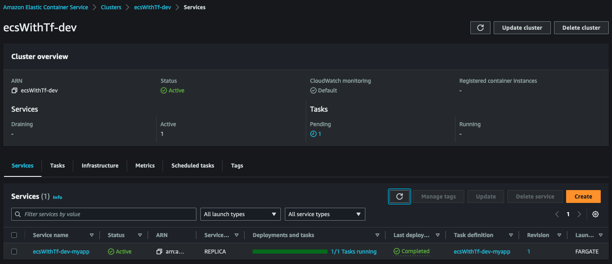
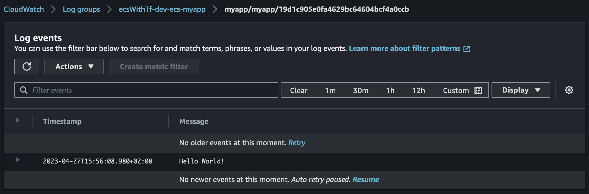

# ECS with terraform

## Prerequis

Nous considérerons ici que certains éléments existent déjà dans le compte AWS ou nous ferons nos tests. Notamment un VPC configuré avec des réseaux privé ayant un accès a internet via une NAT Gateway.  
Le repository de démonstration contient du code permettant de mettre en place ces prerequis si necessaire.  

## Cluster et 1er container

Commençons par créer le cluster et faire tourner un simple container dessus.  
Il nous faut donc :
- un cluster et un log group associé,
- un service & une task definition,
- un rôle iam (qui permettra à terme de donner des droits au container),
- un security group

Nous prendrons une image Debian pour faciliter les tests dans un premier temps. Le code ressemble donc à :  

```terraform
locals {
  prefix   = "${var.project_prefix}-${var.env}"
  app_name = "myapp"
}

resource "aws_cloudwatch_log_group" "ecs_cluster" {
  name = "${local.prefix}-ecs-cluster"
}
resource "aws_ecs_cluster" "this" {
  name = local.prefix

  configuration {
    execute_command_configuration {
      logging = "OVERRIDE"

      log_configuration {
        cloud_watch_log_group_name = aws_cloudwatch_log_group.ecs_cluster.name
      }
    }
  }
}

resource "aws_ecs_task_definition" "myapp" {
  family                   = "${local.prefix}-${local.app_name}"
  requires_compatibilities = ["FARGATE"]
  network_mode             = "awsvpc"
  cpu                      = 1024
  memory                   = 2048

  task_role_arn = aws_iam_role.ecs_task_role_myapp.arn

  container_definitions = jsonencode([
    {
      name   = local.app_name
      image  = "debian:buster-20230411-slim"
      cpu    = 1024
      memory = 2048

      command         = [ "sleep", "3600" ],
      linuxParameters = {
        "initProcessEnabled"= true
      }
    }
  ])

  runtime_platform {
    operating_system_family = "LINUX"
    cpu_architecture        = "X86_64"
  }
}
resource "aws_ecs_service" "myapp" {
  name            = "${local.prefix}-${local.app_name}"
  cluster         = aws_ecs_cluster.this.id
  task_definition = aws_ecs_task_definition.myapp.arn
  desired_count   = 1

  enable_execute_command = true

  launch_type = "FARGATE"

  network_configuration {
    subnets          = var.private_subnets
    security_groups  = [aws_security_group.myapp.id]
    assign_public_ip = false
  }
}

resource "aws_iam_role" "ecs_task_role_myapp" {
  name = "${local.prefix}-ecs-task-role-${local.app_name}"

  assume_role_policy = jsonencode({
    Version = "2012-10-17"
    Statement = [
      {
        Action = "sts:AssumeRole"
        Effect = "Allow"
        Sid    = ""
        Principal = {
          Service = "ecs-tasks.amazonaws.com"
        }
      }
    ]
  })

  inline_policy {
    name = "requirements-for-ecs-exec"

    policy = jsonencode({
      Version: "2012-10-17",
      Statement: []
    })
  }
}

resource "aws_security_group" "myapp" {
  name        = "${local.prefix}-ecs-${local.app_name}"
  description = "manage rules for ${local.app_name} ecs service"
  vpc_id      = var.vpc_id

  egress {
    from_port        = 0
    to_port          = 0
    protocol         = "-1"
    cidr_blocks      = ["0.0.0.0/0"]
    ipv6_cidr_blocks = ["::/0"]
  }
}
```

We now have a first container running on aws :  
  

## ECS Exec

[ECS Exec](https://docs.aws.amazon.com/en_en/AmazonECS/latest/userguide/ecs-exec.html) est une feature qui permet d'interagir et notamment se connecter dans les containers directement via la cli aws.  
En s'appuyant sur les prerequis détaillés dans le lien précédent, modifions le rôle iam pour y ajouter une policy inline et la définiton de notre task pour activer la feature :

```
resource "aws_iam_role" "ecs_task_role_myapp" {
  name = "${local.prefix}-ecs-task-role-${local.app_name}"

  ...

  inline_policy {
    name = "requirements-for-ecs-exec"

    policy = jsonencode({
      Version: "2012-10-17",
      Statement: [
        {
          "Effect": "Allow",
          "Action": [
            "ssmmessages:CreateControlChannel",
            "ssmmessages:CreateDataChannel",
            "ssmmessages:OpenControlChannel",
            "ssmmessages:OpenDataChannel"
          ],
          "Resource": "*"
        }
      ]
    })
  }

}

resource "aws_ecs_task_definition" "myapp" {
  task_role_arn = aws_iam_role.ecs_task_role_myapp.arn

  ...

  container_definitions = jsonencode([
    {
      image = "debian:buster-20230411-slim"

      ...

      linuxParameters = {
        "initProcessEnabled"= true
      }
    }
  ])
}
```

Nous pouvons dés lors utiliser la cli aws pour se connecter directement dans le container Debian. Il suffit de récupérer via la console le nom du cluster ECS, l'id de la task et le nom du container pour forger une commande similaire à :  

```shell
aws ecs execute-command --cluster ecsWithTf-dev \
    --task 32f4aaa9555f4a188789226094c70485 \
    --container myapp \
    --interactive \
    --command "/bin/sh"
```

Nous avons un pied directement dans le cluster :  
```
# uname -a
Linux ip-10-0-3-184.eu-west-1.compute.internal 5.10.177-158.645.amzn2.x86_64 #1 SMP Thu Apr 6 16:53:11 UTC 2023 x86_64 GNU/Linux
```

## Log Driver

Attelons nous à la possibilité pour nos containers d'écrire leur log dans cloudwatch.  
Il nous faut créer un log group et un second rôle IAM. Le premier servant à donner des droits a notre application : le **task_role**.  Le second, le **execution_role**, permettant de donner des droits à l'agent ECS et au daemon docker afin qu'ils puissent écrire dans cloudwatch :  

```
resource "aws_cloudwatch_log_group" "myapp" {
  name = "${local.name_prefix}-ecs-${local.app_name}"

  retention_in_days = 90
}

# role that allows your Amazon ECS container task to make calls to other AWS services.
resource "aws_iam_role" "ecs_task_role_myapp" {
  name = "${local.prefix}-ecs-task-role-${local.app_name}"

  ...
}

# role that the Amazon ECS container agent and the Docker daemon can assume (required for using awslogs log driver).
resource "aws_iam_role" "ecs_execution_role_myapp" {
  name = "${local.name_prefix}-ecs-execution-role-${local.app_name}"

  assume_role_policy = jsonencode({
    Version = "2012-10-17"
    Statement = [
      {
        Action = "sts:AssumeRole"
        Effect = "Allow"
        Sid    = ""
        Principal = {
          Service = "ecs-tasks.amazonaws.com"
        }
      }
    ]
  })

  inline_policy {
    name = "requirements-for-log-driver"

    policy = jsonencode({
      Version : "2012-10-17",
      Statement : [
        {
          "Effect" : "Allow",
          "Action" : [
            "logs:CreateLogStream",
            "logs:PutLogEvents"
          ],
          "Resource" : "*"
        }
      ]
    })
  }
}

resource "aws_ecs_task_definition" "myapp" {

  task_role_arn      = aws_iam_role.ecs_task_role_myapp.arn
  execution_role_arn = aws_iam_role.ecs_execution_role_myapp.arn

  container_definitions = jsonencode([
    {
      command = [
        "sh",
        "-c",
        "echo 'Hello World!' && sleep 3600"
      ]

      logConfiguration = {
          "logDriver" = "awslogs",
          "options" = {
              "awslogs-group" = aws_cloudwatch_log_group.myapp.name,
              "awslogs-region" = local.region,
              "awslogs-stream-prefix" = "myapp"
          }
      },

      ...
    }
  ])

  ...
}
```

Une fois que le container a fini de redémarrer nous pouvons ouvrir cloudwatch et constater l'apparition d'un logstream contenant le *Hello World!* généré par notre commande.  
  

> Pensez à logguer en json si possible. C'est nativement supporté et formaté par Cloudwatch et ça vous simpliefiera la vie plus tard :wink:

## Exposition via load balancer

Pour cette partie changeons d'image docker pour déployer un serveur Nginx et tester l'exposition d'un container via un load balancer. Il nous faut :
- créer le load balancer, un listener et un target group
- modifier la configuration de la task et du service ecs pour ouvrir un port et le mapper avec le target group
- modifier le Security Group pour autoriser le traffic

Rajoutons donc le code terraform suivant :

```shell
resource "aws_ecs_task_definition" "myapp" {
  ...

  container_definitions = jsonencode([
    {
      name  = local.app_name
      image = "nginx:1.24.0"
      # command = [ "sh", "-c", "echo 'Hello World!' && sleep 3600"]

      portMappings = [
        {
          containerPort = 80
          hostPort      = 80
          protocol      = "tcp"
        }
      ],

      ...
    }
  ])
}

resource "aws_ecs_service" "myapp" {
  name = "${local.prefix}-${local.app_name}"
  ...

  load_balancer {
    target_group_arn = aws_lb_target_group.myapp.arn
    container_name   = local.app_name
    container_port   = 80
  }

  depends_on = [aws_lb_listener.myapp]
}

resource "aws_security_group" "myapp" {
  name = "${local.prefix}-ecs-${local.app_name}"
  ...

  ingress {
    description = "myapp ingress"
    from_port   = 80
    to_port     = 80
    protocol    = "tcp"
    cidr_blocks = [var.vpc_cidr]
  }
}

resource "aws_lb" "this" {
  name = local.prefix

  internal           = true
  load_balancer_type = "network"
  subnets            = var.private_subnets

  enable_deletion_protection = var.env == "prd" ? true : false
}

resource "aws_lb_target_group" "myapp" {
  name = "${local.prefix}-ecs${local.app_name}-80"

  port        = 80
  protocol    = "TCP"
  target_type = "ip"
  vpc_id      = var.vpc_id

  health_check {
    healthy_threshold   = "3"
    interval            = "300"
    protocol            = "HTTP"
    matcher             = "200"
    timeout             = "3"
    path                = "/"
    unhealthy_threshold = "2"
  }
}

resource "aws_lb_listener" "myapp" {
  load_balancer_arn = aws_lb.this.arn
  port              = 80
  protocol          = "TCP"

  default_action {
    type             = "forward"
    target_group_arn = aws_lb_target_group.myapp.arn
  }
}
```

Nous pouvons désormais accéder directement au site exposé par le pod.  
Si le load balancer est exposé sur internet il suffit de récupérer le DNS Name de ce dernier et d'y accéder en http : `http://<dns_du_load_balancer>`.  
Dans notre cas le load balancer est interne et n'est accessible que depuis l'intérieur du VPC. Pour exposer le service localement nous pouvons utiliser ssm et le bastion précédemment mis en place.

A l'aide du nom dns du LB et de l'ID de l'instance EC2 servant de bastion, forgeons la commande suivante : 

```
aws ssm start-session --target <BASTION_ID> \
  --document-name AWS-StartPortForwardingSessionToRemoteHost \
  --parameters '{"host":["<LB_DNS_NAME>"],"portNumber":["80"], "localPortNumber":["8080"]}'
```

Dans notre exemple :  

```
aws ssm start-session --target i-0a521629659d7a339 \
  --document-name AWS-StartPortForwardingSessionToRemoteHost \
  --parameters '{"host":["ecsWithTf-dev-6b5b9d0f19671471.elb.eu-west-1.amazonaws.com"],"portNumber":["80"], "localPortNumber":["8080"]}'
```

Le port 80 que nous avons ouvert sur le container Nginx est alors exposé localement sur le port 8080 de notre PC. Il suffit d'ouvrir un navigateur et de visiter `http://localhost:8080/` :  
  
